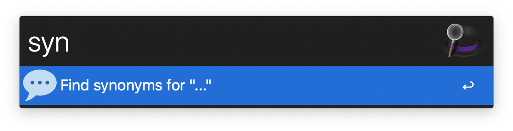
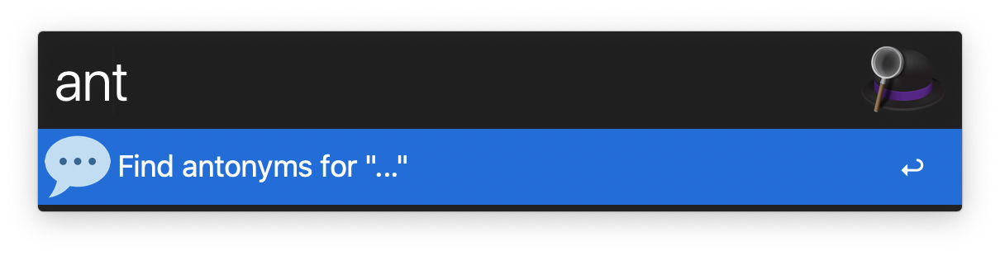

  <h1>Alfred Words 💬</h1>

  <strong>Find synonyms and antonyms from thesaurus.com</strong> 
  
  

## Installation

1. Download the Alfred Workflow ([Words.alfredworkflow](https://github.com/epilande/alfred-words/releases/latest/download/Words.alfredworkflow)).
1. Double-click to import into Alfred (requires Powerpack).

## Usage

- `syn {word}` - Find synonyms for `{word}`.
- `ant {word}` - Find antonyms for `{word}`.

## Demo

## More workflows

- 🔍 [alfred-browser-tabs](https://github.com/epilande/alfred-browser-tabs) - Search browser tabs from Chrome, Brave, & Safari.
- 🤫 [alfred-be-quiet](https://github.com/epilande/alfred-be-quiet) - Workflow to automatically pause audio/video playing.
- 🔐 [alfred-wifi-password](https://github.com/epilande/alfred-wifi-password) - Get Wi-Fi password from Keychain.
- 🗝 [alfred-password-generator](https://github.com/epilande/alfred-password-generator) - Workflow to generate passwords.
- 🎨 [alfred-prettier-clipboard](https://github.com/epilande/alfred-prettier-clipboard) - Format code in your clipboard with Prettier.
- 🖊 [alfred-markdown](https://github.com/epilande/alfred-markdown) - Markdown text expander.
<!-- - 💡 [alfred-govee](https://github.com/epilande/alfred-govee) - Workflow to interact with your Govee devices. -->

## License

[MIT License](https://oss.ninja/mit/epilande/)
